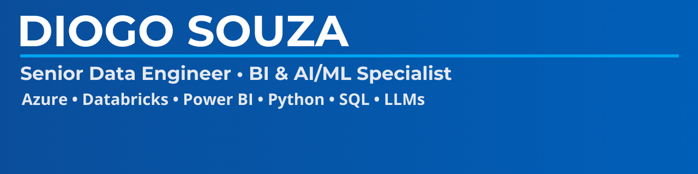

<!-- ============================================= -->
<!--            PLACEHOLDER DO BANNER               -->
<!-- Substitua pela imagem criada no Canva depois  -->
<!-- ============================================= -->

  

<h1 align="center">Hi, I'm Diogo Souza 👋</h1>

<b>Senior Data Engineer | BI & AI/ML Specialist</b> Madrid, Spain 🇪🇸

<!-- ============================================= -->
<!--                  BADGES CORPORATE             -->
<!-- ============================================= -->

  
  
  
  
  
  

---

# 🚀 About Me

I’m a **Senior Data Engineer** with nearly **15 years of experience** designing and delivering data solutions across aviation, finance, government, and large-scale enterprise environments.

My work focuses on:

- Data Engineering & Architecture  
- Business Intelligence (Power BI, Tableau, Looker)  
- AI & Machine Learning  
- Azure Cloud & Databricks  
- ETL/ELT pipelines  
- Dimensional modeling (Kimball)  
- LLM-based automations and RAG systems  

I build **AI-ready data ecosystems** that make analytics faster, scalable, and intelligent.

---

# 📂 Featured Portfolio

👉 **Full Portfolio**  
🔗 https://github.com/diogolsouza/portfolio

### 📊 Business Intelligence  
- Power BI: AdventureWorks, Superstore, HR Analytics  
- Tableau: NYC Taxi, Sales dashboards  
- Looker Studio: Web analytics, funnel visualizations  

### 🛠 Data Engineering  
- Azure Data Factory pipelines  
- Databricks ETL (Bronze → Silver → Gold)  
- SQL pipelines & models  
- Incremental loads & SCD logic  

### 🤖 Machine Learning  
- Churn model  
- Fraud detection  
- Customer segmentation  
- Sentiment analysis  
- Azure ML deployment  

### 🧠 AI / LLM Projects  
- Resume Analyzer (LLM)  
- Data Governance RAG Assistant  
- Agentic Data Engineer  
- Prompt engineering library  

---

# 🛠 Tech Stack

**Cloud & Engineering**
- Azure Data Factory, Azure SQL MI  
- Databricks (Delta Lake, PySpark)  
- SQL Server, SSMS, SQL Modeling  
- CI/CD, GitHub  

**BI & Analytics**
- Power BI  
- Tableau  
- Looker Studio  
- DAX, LODs, Data Modeling  

**Machine Learning & AI**
- Python (pandas, numpy, sklearn)  
- LLMs (OpenAI, Azure OpenAI, LangChain)  
- RAG, vector stores  
- Model deployment & automation  

---

## 🏅 Certifications

This portfolio is supported by a strong set of certifications across 
Azure, AWS, Google Cloud, Databricks, and DAMA International — 
covering both Data Engineering and AI/ML.  
For the full certification list, see my GitHub profile:  
👉 https://github.com/diogolsouza

### 🟦 Microsoft
- DP-900 — Azure Data Fundamentals  
- PL-300 — Power BI Data Analyst Associate  
- DP-700 — Data Analyst Associate  
- DP-600 — Fabric Analytics Engineer Associate  
- AZ-104 — Azure Administrator Associate  
- AZ-305 — Azure Solutions Architect Expert  
- AZ-400 — Designing and Implementing Microsoft DevOps Solutions  
- AI-900 — Azure AI Fundamentals  
- AI-102 — Azure AI Engineer Associate  
- AI-050 — Azure OpenAI Fundamentals  
- AB-100 — Agentic AI Business Solutions Architect (beta)  

---

### 🟧 AWS
- CLF-C02 — AWS Certified Cloud Practitioner  
- SAA-C03 — AWS Certified Solutions Architect – Associate  
- DEA-C01 — AWS Certified Data Engineer – Associate  
- SAP-C02 — AWS Certified Solutions Architect – Professional  
- DOP-C02 — AWS Certified DevOps Engineer – Professional  
- MLS-C01 — AWS Certified Machine Learning – Specialty  
- DAS-C01 — AWS Certified Data Analytics – Specialty  
- GAI-A01 — AWS Certified Generative AI Engineer – Associate  

---

### 🟦 Google Cloud
- GCP-CDL — Cloud Digital Leader  
- GCP-ACE — Associate Cloud Engineer  
- GCP-PDE — Professional Data Engineer  
- GCP-PCA — Professional Cloud Architect  
- GCP-PMLE — Google Professional Machine Learning Engineer  
- GCP-GAI — Google Cloud Generative AI Engineer  

---

### 🔴 Databricks
- Databricks Accredited Lakehouse Platform Fundamentals  
- Databricks Certified Data Engineer Associate  
- Databricks Certified Data Engineer Professional  
- Databricks Certified Associate Developer for Apache Spark (Python)  
- ML-Associate — Databricks Certified Machine Learning Associate  
- ML-Professional — Databricks Certified Machine Learning Professional  
- GenAI — Databricks Generative AI Professional  

---

### 🟣 DAMA International
- CDMP — Data Management Fundamentals  
- CDMP — Data Modeling & Design (Specialist Exam)  
- CDMP — Data Warehousing & Business Intelligence (Specialist Exam)  

---

### 🟡 TDWI
- CBIP — Data Foundations Exam  
- CBIP — IS Core Exam  
- CBIP — Data Integration (Specialty Exam)  

---

### 📊 INFORMS / CertifiedAnalytics.org
- CAP — Certified Analytics Professional  

---

### 📈 Tableau
- TCCP — Tableau Certified Consultant / Professional  
- TCAI — Tableau + Einstein Discovery: AI Integration Specialist  

---

### 🧠 NVIDIA
- NVAIE — NVIDIA Certified AI Engineer  
- DLI-DL — NVIDIA Deep Learning Institute – Fundamentals of Deep Learning  

---

### 🧩 IBM
- IBM-AI — IBM AI Engineering Professional Certificate  
- IBM-ML — IBM Machine Learning Professional Certificate  

---

# 📫 Contact

**LinkedIn:** https://www.linkedin.com/in/diogo-souza/  
**Location:** Madrid, Spain  
**GitHub:** https://github.com/diogolsouza  

---

⭐ Thanks for visiting my profile! Feel free to explore my work or get in touch.

